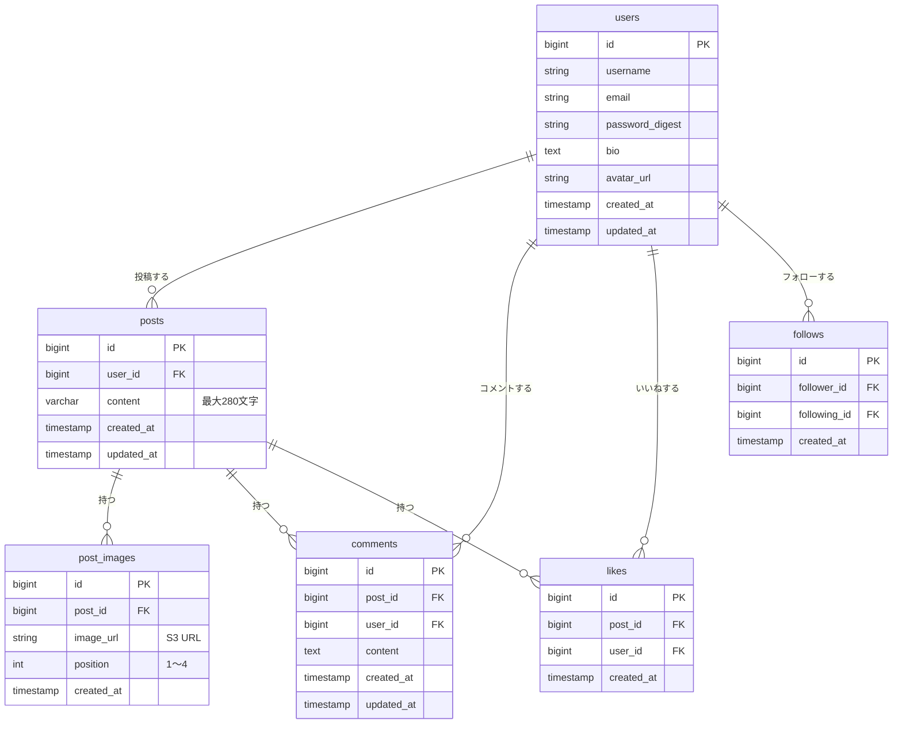

# RaiseTimeLine

X（Twitter）風のタイムライン型SNSアプリ（学習目的）

---

## アプリ概要

テキスト・画像の投稿、コメント、いいね、フォローができるタイムライン形式のSNS風Webアプリです。

### 開発背景

X（Twitter）のようなSNSアプリは日常的に利用する機会が多く、「どのような仕組みで動いているのか」を実際に手を動かして理解したいと考えました。タイムライン表示・フォロー管理・画像アップロードといったSNSの中核機能をフルスタックで実装することで、フロントエンドからバックエンド・インフラまで一貫した開発経験を積むことが目的です。

### 解決できること

- **タイムライン閲覧**：全ユーザーの投稿（全体）またはフォロー中のユーザーの投稿のみ（フォロー中）をタブで切り替えて閲覧できる
- **交流**：投稿へのコメント・いいねで他ユーザーと交流できる
- **ユーザー検索**：ユーザー名の部分一致検索で他のユーザーを見つけ、フォローできる
- **プロフィール管理**：アイコン画像・自己紹介文・ユーザー名を自分で管理できる

### X/Twitterとの差別化

- インプレッション数は表示しない
- リツイート機能は提供しない

---

## 技術スタック

### バックエンド

| 役割 | 技術 | バージョン |
|------|------|----------|
| 言語 | Java | 21 |
| フレームワーク | Spring Boot | 3.x |
| 認証 | JWT（jjwt） | 0.12.x |
| パスワード暗号化 | bcrypt（Spring Security） | Spring Boot同梱 |
| ORM | Spring Data JPA / Hibernate | Spring Boot同梱 |
| DBマイグレーション | Flyway | 9.x |
| ビルドツール | Gradle | 8.x |

### フロントエンド

| 役割 | 技術 | バージョン |
|------|------|----------|
| フレームワーク | React | 18.x |
| 言語 | TypeScript | 5.x |
| 状態管理 | React Context API / useState | React同梱 |

### データベース・インフラ

| 役割 | 技術 |
|------|------|
| データベース | PostgreSQL 16.x |
| 画像ストレージ | AWS S3 |
| ロードバランサー | ALB（Application Load Balancer）※予定 |
| サーバー | EC2（t3.micro）※予定 |
| DB | RDS（PostgreSQL 16.x）※予定 |

詳細は [docs/tech-stack.md](docs/tech-stack.md) / [docs/infrastructure.md](docs/infrastructure.md) を参照してください。

---

## 実装予定機能

| 機能 | 概要 |
|------|------|
| ユーザー登録・ログイン | メール+パスワードによる新規登録・ログイン・ログアウト（JWT認証） |
| タイムライン（全体） | 全ユーザーの投稿を新着順で表示 |
| タイムライン（フォロー中） | フォロー中のユーザーの投稿のみ新着順で表示。タブで切り替え |
| 投稿 | テキスト（最大280文字）＋画像（最大4枚）の投稿作成・削除 |
| コメント | 投稿へのコメント投稿・削除・コメント数表示 |
| いいね | 投稿へのいいね追加・取り消し・いいね数表示 |
| プロフィール | ユーザー名・アイコン画像・自己紹介文の表示・編集 |
| フォロー/フォロワー | フォロー・フォロー解除・フォロー一覧・フォロワー一覧 |
| ユーザー検索 | ユーザー名の部分一致検索（大文字・小文字不問） |

---

## 画面構成

### ① タイムライン画面（ホーム）

全体タイムラインとフォロータイムラインをタブで切り替えて表示。各投稿カードにはいいねボタン・コメント数を表示し、ユーザー名クリックでプロフィール画面へ遷移する。

### ② 投稿作成画面

テキスト（最大280文字、残り文字数カウント付き）と画像（最大4枚）を添付して投稿できる。

### ③ 投稿詳細画面

投稿の全文・添付画像・いいね・コメント一覧を表示。コメント投稿者のユーザー名クリックでプロフィール画面へ遷移できる。

### ④ プロフィール画面

ユーザーのアイコン・ユーザー名・自己紹介・フォロー数・フォロワー数・投稿一覧を表示。他ユーザーにはフォローボタンを表示。

### ⑤ ユーザー検索画面

ユーザー名でリアルタイム部分一致検索。検索結果からその場でフォロー可能。

画面設計の詳細は [docs/screen-design.md](docs/screen-design.md) を参照してください。

---

## ドキュメント

### 要件・設計

| ドキュメント | 内容 |
|------------|------|
| [docs/requirements.md](docs/requirements.md) | 要件定義書（概要・非機能要件・制約） |
| [docs/features.md](docs/features.md) | 機能一覧（表形式）＋全体のユースケース |
| [docs/screen-design.md](docs/screen-design.md) | 画面設計書（画面一覧・ワイヤーフレーム・画面遷移図） |
| [docs/database-design.md](docs/database-design.md) | データベース設計書（Mermaid ER図・テーブル定義） |
| [docs/tech-stack.md](docs/tech-stack.md) | 技術スタック |
| [docs/infrastructure.md](docs/infrastructure.md) | インフラ構成（AWS構成図・サービス一覧） |

### 機能定義書

| ドキュメント | 対象機能 |
|------------|---------|
| [docs/features/authentication.md](docs/features/authentication.md) | ユーザー登録・ログイン |
| [docs/features/timeline.md](docs/features/timeline.md) | タイムライン（全体・フォロー中） |
| [docs/features/post.md](docs/features/post.md) | 投稿（作成・削除・画像添付） |
| [docs/features/comment.md](docs/features/comment.md) | コメント |
| [docs/features/like.md](docs/features/like.md) | いいね |
| [docs/features/profile.md](docs/features/profile.md) | プロフィール・フォロー/フォロワー |
| [docs/features/user-search.md](docs/features/user-search.md) | ユーザー検索 |

---

## ER図

詳細は [docs/database-design.md](docs/database-design.md) を参照してください。



---

## AWS構成

詳細は [docs/infrastructure.md](docs/infrastructure.md) を参照してください。

```
ユーザー
  │ HTTPS
  ▼
[ALB（Application Load Balancer）]
  │
  ▼
[EC2] nginx
  ├── /api  → Spring Boot（ポート8080）
  └── /     → React 静的ファイル
  │
  ▼
[RDS（PostgreSQL）]        [S3]
                           ├── 投稿画像
                           └── アイコン画像
```

---

## ローカル環境での起動方法

> ※ 実装後に更新予定

### 前提条件

- Java 21 以上
- Node.js 20 以上
- Docker / Docker Compose（PostgreSQL用）

### 1. リポジトリをクローン

```bash
git clone https://github.com/KAT-brave/RaiseTimeLine.git
cd RaiseTimeLine
```

### 2. バックエンドを起動

```bash
cd backend
./gradlew bootRun
# → http://localhost:8080 で起動
```

### 3. フロントエンドを起動

```bash
cd frontend
npm install
npm start
# → http://localhost:3000 で起動
```

---

## 工夫する予定の点

- **2種類のタイムライン**：全体タイムラインとフォロータイムラインをタブで切り替えられる設計にし、フォロー0人時は誘導メッセージを表示する
- **S3 presigned URL方式**：フロントエンドからS3に直接アップロードすることでサーバーへの負荷を軽減する
- **ユーザー名クリックでプロフィール遷移**：投稿・コメントどこからでもプロフィールへアクセスしフォローできる導線を設計する
- **フロント・バック両方のバリデーション**：280文字制限・画像枚数制限をフロントとバック両方でチェックする

## 苦労する予定の点（課題）

- **JWTとフロントの連携**：ログイン後のトークン管理とAPIリクエストへの付与
- **S3 presigned URLのフロー**：フロントからS3直接アップロード後にURLをバックエンドへ送る非同期フローの実装
- **フォロータイムラインのクエリ**：フォロー中ユーザーの投稿のみを効率よく取得するJOINクエリの設計
