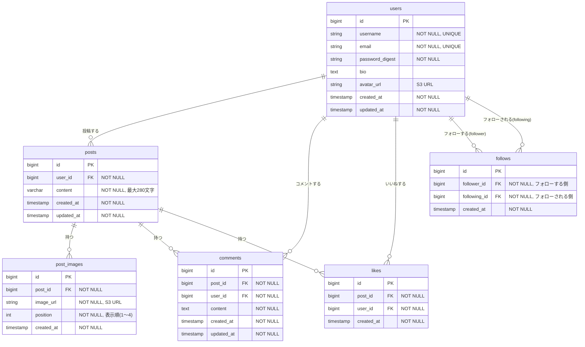

# データベース設計書

## ER図

---

## テーブル定義

### users（ユーザー）

| カラム名 | 型 | 制約 | 説明 |
|----------|-----|------|------|
| id | BIGSERIAL | PK | ユーザーID |
| username | VARCHAR(50) | NOT NULL, UNIQUE | ユーザー名（表示名） |
| email | VARCHAR(255) | NOT NULL, UNIQUE | メールアドレス |
| password_digest | VARCHAR(255) | NOT NULL | ハッシュ化パスワード（bcrypt） |
| bio | TEXT | NULL許容 | 自己紹介文（160文字以内） |
| avatar_url | VARCHAR(500) | NULL許容 | アイコン画像のS3 URL |
| created_at | TIMESTAMP | NOT NULL | 作成日時 |
| updated_at | TIMESTAMP | NOT NULL | 更新日時 |

**インデックス**: `email`、`username` に一意インデックス

---

### posts（投稿）

| カラム名 | 型 | 制約 | 説明 |
|----------|-----|------|------|
| id | BIGSERIAL | PK | 投稿ID |
| user_id | BIGINT | NOT NULL, FK(users.id) | 投稿者 |
| content | VARCHAR(280) | NOT NULL | 投稿本文（最大280文字） |
| created_at | TIMESTAMP | NOT NULL | 作成日時 |
| updated_at | TIMESTAMP | NOT NULL | 更新日時 |

**インデックス**: `user_id`、`created_at`（タイムライン取得の高速化）

---

### post_images（投稿画像）

| カラム名 | 型 | 制約 | 説明 |
|----------|-----|------|------|
| id | BIGSERIAL | PK | 画像ID |
| post_id | BIGINT | NOT NULL, FK(posts.id) | 紐づく投稿 |
| image_url | VARCHAR(500) | NOT NULL | AWS S3の画像URL |
| position | INTEGER | NOT NULL | 表示順（1〜4） |
| created_at | TIMESTAMP | NOT NULL | 作成日時 |

**制約**:
- `(post_id, position)` に UNIQUE 制約
- 1投稿につき最大4枚（アプリ側でも制御）

---

### comments（コメント）

| カラム名 | 型 | 制約 | 説明 |
|----------|-----|------|------|
| id | BIGSERIAL | PK | コメントID |
| post_id | BIGINT | NOT NULL, FK(posts.id) | 紐づく投稿 |
| user_id | BIGINT | NOT NULL, FK(users.id) | コメント投稿者 |
| content | TEXT | NOT NULL | コメント本文 |
| created_at | TIMESTAMP | NOT NULL | 作成日時 |
| updated_at | TIMESTAMP | NOT NULL | 更新日時 |

**インデックス**: `post_id`

---

### likes（いいね）

| カラム名 | 型 | 制約 | 説明 |
|----------|-----|------|------|
| id | BIGSERIAL | PK | いいねID |
| post_id | BIGINT | NOT NULL, FK(posts.id) | 紐づく投稿 |
| user_id | BIGINT | NOT NULL, FK(users.id) | いいねしたユーザー |
| created_at | TIMESTAMP | NOT NULL | 作成日時 |

**制約**: `(post_id, user_id)` に UNIQUE 制約（1ユーザー1投稿1回のみ）

---

### follows（フォロー）

| カラム名 | 型 | 制約 | 説明 |
|----------|-----|------|------|
| id | BIGSERIAL | PK | フォローID |
| follower_id | BIGINT | NOT NULL, FK(users.id) | フォローする側のユーザーID |
| following_id | BIGINT | NOT NULL, FK(users.id) | フォローされる側のユーザーID |
| created_at | TIMESTAMP | NOT NULL | 作成日時 |

**制約**:
- `(follower_id, following_id)` に UNIQUE 制約（重複フォロー防止）
- `follower_id != following_id` チェック制約（自己フォロー防止）

---

## リレーション一覧

| テーブルA | テーブルB | 関係 | 説明 |
|-----------|-----------|------|------|
| users | posts | 1 : N | 1ユーザーは複数の投稿を持つ |
| users | comments | 1 : N | 1ユーザーは複数のコメントを持つ |
| users | likes | 1 : N | 1ユーザーは複数のいいねを持つ |
| users | follows | 1 : N | 1ユーザーは複数のフォロー関係を持つ（follower/following双方） |
| posts | post_images | 1 : N | 1投稿は最大4枚の画像を持つ（S3保存） |
| posts | comments | 1 : N | 1投稿は複数のコメントを持つ |
| posts | likes | 1 : N | 1投稿は複数のいいねを持つ |
| users | users | N : M | followsテーブルを介して多対多（フォロー関係） |
